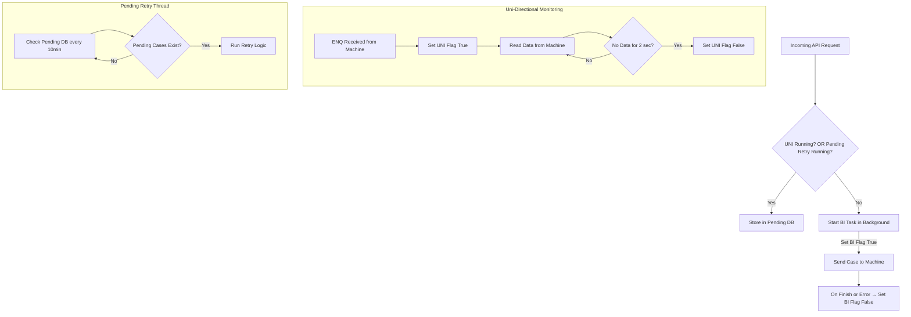

                            ┌───────────────────────────────────┐
                            │ Start (all flags False)           │
                            │ (U=0, B=0, P=0, R=0)              │
                            └───────────────────────────────────┘
                                            │
                                            │ ENQ (0x05) arrives
                                            ▼
                        ┌───────────────────────────────────────────┐
                        │ UNI start                                 │
                        │ (U=1, B=0, P=0, R=1)                      │
                        │ continuous_receiving_data(connection)     │
                        └───────────────────────────────────────────┘
                                            │
                                            │ Data continues
                                            ▼
                        ┌───────────────────────────────────────────┐
                        │ Still UNI                                 │
                        │ Flags stay (U=1, B=0, P=0, R=1)           │
                        └───────────────────────────────────────────┘
                                            │
                                            │ No data for 2 sec
                                            ▼
                        ┌───────────────────────────────────────────┐
                        │ UNI stops                                 │
                        │ (U=0, B=0, P=0, R=0)                      │
                        └───────────────────────────────────────────┘
                                             │
                                             |
                ┌────────────────────────────┴──────────────────────────────┐
                │                                                           │
                │                                                           │  
                ▼                                                           ▼    
    API call for BI (when all flags 0)                           Retry thread time triggers
    ┌────────────────────────────────┐                           ┌─────────────────────────┐
    │ BI start                       │                           │ Pending Retry start     │
    │ (U=0, B=1, P=0, R=0)           │                           │ (U=0, B=0, P=1, R=0)    │
    │ run_bi_task()                  │                           └─────────────────────────┘
    └────────────────────────────────┘                                      │
        │                                                                   │ 
        │ BI finishes                                                       │ Retry finishes
        ▼                                                                   ▼
    ┌────────────────────────────────┐                           ┌─────────────────────────┐
    │ Back to idle                   │                           │ Back to idle            │
    │ (U=0, B=0, P=0, R=0)           │                           │ (U=0, B=0, P=0, R=0)    │
    └────────────────────────────────┘                           └─────────────────────────┘

# Flag Workflow and Conflict-Free Operation

This document explains how the flags (`IS_UNIDIRECTIONAL_RUNNING`, `IS_BIDIRECTIONAL_RUNNING`, `IS_PENDING_RETRY_RUNNING`) coordinate to ensure conflict-free operations when interacting with the machine.

## Workflow Diagram

## How Flags Prevent Conflicts

- **IS_UNIDIRECTIONAL_RUNNING**
  - True only when UNI mode is active (machine sends ENQ and data is flowing).
  - False if BI is active or if timeout (no bytes for >2 sec) occurs.

- **IS_BIDIRECTIONAL_RUNNING**
  - True only while a BI API call is actively sending/receiving from the machine.
  - Forces UNI to stop immediately to avoid port conflicts.

- **IS_PENDING_RETRY_RUNNING**
  - True only while pending retry thread processes queued cases.
  - Prevents new BI tasks from starting during retry.

## Sequence Scenarios

1. **Machine Sends Data (UNI Active)**
   - UNI flag goes `True`, BI and Retry flags are `False`.
   - API requests will be stored in pending DB.

2. **API Request While UNI Active**
   - Request stored in pending DB because UNI flag is `True`.

3. **API Request While Idle**
   - BI task starts, sets BI flag `True`, blocks UNI until finished.

4. **Pending Retry Cycle**
   - Runs every 10 min if no BI or UNI activity.
   - Sets Retry flag `True` during processing.

## Safety Guarantees
- Flags are modified only inside `with FLAG_LOCK` blocks to prevent race conditions.
- UNI stops the moment BI starts.
- Retry never overlaps with BI or UNI.

